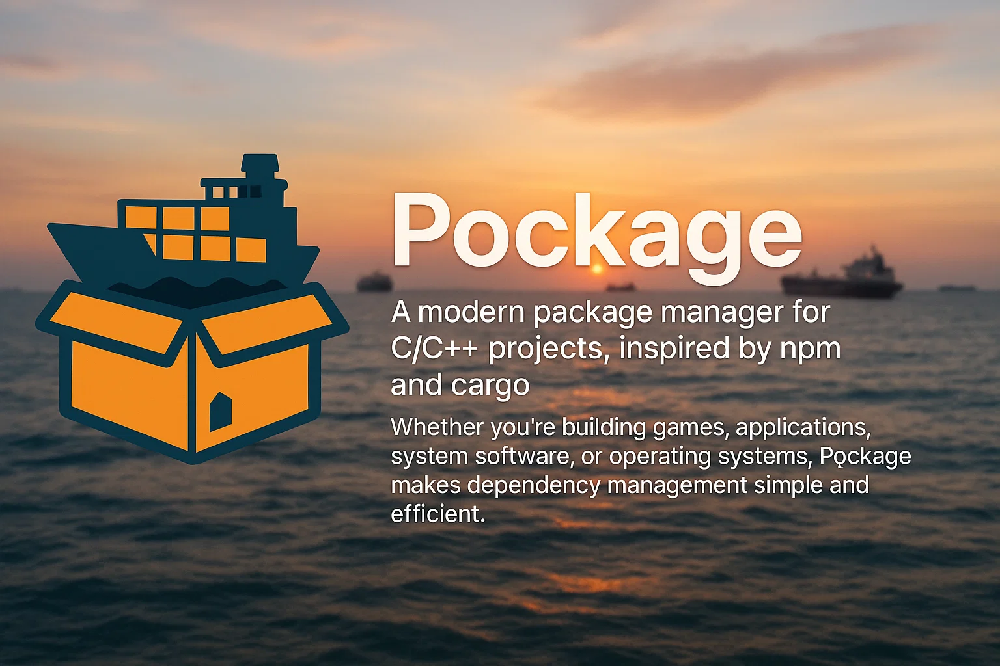

<p align="center">
  
</p>

# 🚢📦 Pockage — The npm for C/C++

[](https://www.python.org/downloads/)
[](LICENSE)
[](https://github.com/Jaseunda/pockage)
[](https://github.com/Jaseunda/pockage)

> ⚠️ **Early Development**: Pockage is in its early stages. Expect breaking changes and limited features.

Pockage is a modern package manager for C/C++ projects, inspired by npm and cargo. Whether you're building games, applications, system software, or operating systems, Pockage makes dependency management simple and efficient.

## ✨ Features

- 🛠 One-command setup: Install C/C++ libraries without manual configuration
- 📦 Dependency management: Like npm for JavaScript, but for C/C++
- 🚀 Smart build system: Auto-detect sources, compile, and link
- 📂 Cross-platform: Windows, macOS, Linux, iOS, Android
- 💬 Community-driven: Open source and welcoming to contributions
- 📜 No vendor lock-in: All downloads from official sources
- 🔒 MIT Licensed: Free for personal and commercial use

## 🚀 Quick Start

### Installation

#### macOS/Linux
```bash
curl -L https://raw.githubusercontent.com/Jaseunda/pockage/main/install.sh | bash
```

#### Windows
```powershell
curl -L https://raw.githubusercontent.com/Jaseunda/pockage/main/install.bat -o install.bat && install.bat
```

### Create a New Project
```bash
# Create and enter project directory
mkdir myproject
cd myproject

# Initialize project (like npm init)
pockage new

# Or create a project with specific platforms enabled
pockage new -p macos windows linux
```

### Install Dependencies
```bash
# Install all dependencies from pockage.json (like npm install)
pockage install

# Or install specific library (like npm install <package>)
pockage install sdl2
```

### Build and Run
```bash
# Build project
pockage build

# Run project
pockage run
```

## 📦 Library Management

### Adding Libraries
To add a library to your project, edit `pockage.json` and add it to the dependencies:

```json
{
  "dependencies": {
    "sdl2": "2.28.5",
    "imgui": "1.89.9"
  }
}
```

Then run:
```bash
pockage install
```

### Removing Libraries
To remove a library:
```bash
pockage uninstall sdl2
```

### Updating Libraries
To update all libraries to their latest versions:
```bash
pockage update
```

### Searching Libraries
To search for available libraries:
```bash
pockage search sdl
```

## 📦 Supported Libraries

| Library | Version | License | Description |
|---------|---------|---------|-------------|
| [SDL2](https://www.libsdl.org/) | 2.28.5 | zlib | Cross-platform development library |
| [Dear ImGui](https://github.com/ocornut/imgui) | 1.89.9 | MIT | Bloat-free GUI for C++ |
| [FreeType](https://www.freetype.org/) | 2.13.2 | FreeType License | Font rendering library |
| [SFML](https://www.sfml-dev.org/) | 2.6.1 | zlib | Simple and Fast Multimedia Library |
| [GLFW](https://www.glfw.org/) | 3.4.0 | zlib/libpng | OpenGL/Vulkan window creation |
| [Bullet Physics](https://pybullet.org/) | 3.25 | zlib | 3D physics engine |
| [Assimp](https://www.assimp.org/) | 5.3.1 | BSD | 3D model loading |
| [OpenAL Soft](https://openal-soft.org/) | 1.23.1 | LGPL | 3D audio library |
| [Box2D](https://box2d.org/) | 2.4.1 | MIT | 2D physics engine |
| [RapidJSON](https://rapidjson.org/) | 1.1.0 | MIT | Fast JSON parser |
| [fmt](https://fmt.dev/) | 10.2.1 | MIT | Modern formatting library |
| [spdlog](https://github.com/gabime/spdlog) | 1.13.0 | MIT | Fast logging library |
| [EnTT](https://github.com/skypjack/entt) | 3.13.1 | MIT | Entity Component System |

### Adding New Libraries
To add support for a new library, create a pull request with:
1. Library information in `registry/supported.json`
2. Download URLs for all supported platforms
3. Extraction method for the library
4. License information

Example format:
```json
{
  "library_name": {
    "name": "Library Name",
    "latest_version": "1.0.0",
    "versions": {
      "1.0.0": {
        "url_windows": "https://...",
        "url_macos": "https://...",
        "url_linux": "https://..."
      }
    },
    "description": "Library description",
    "license": "License name"
  }
}
```

## 🔥 Advanced Features

### Platform-Specific Build Configurations

Pockage now supports platform-specific build configurations, allowing you to target multiple platforms from a single project:

- **Automatic Platform Detection**: Automatically uses the correct configuration for your current platform
- **Platform-Specific Output**: Builds are placed in platform-specific directories (e.g., `build/macos/`, `build/windows/`)
- **Customizable Settings**: Each platform can have its own compiler, flags, and library paths
- **Command-Line Selection**: Specify platforms when creating a new project with `pockage new -p macos ios android`

Example `pockage.json` configuration:
```json
{
  "platforms": {
    "macos": {
      "enabled": true,
      "build": {
        "compiler": "clang++",
        "cpp_version": "c++17",
        "output": "build/macos/myapp",
        "include_paths": ["include", "libs/sdl2/SDL2.framework/Headers"],
        "frameworks": ["SDL2"],
        "framework_paths": ["libs/sdl2"]
      }
    },
    "windows": {
      "enabled": false,
      "build": {
        "compiler": "g++",
        "cpp_version": "c++17",
        "output": "build/windows/myapp.exe",
        "include_paths": ["include", "libs/sdl2/include"],
        "lib_paths": ["libs/sdl2/lib"],
        "link_libraries": ["SDL2"]
      }
    }
  }
}
```

Supported platforms:
- macOS (frameworks support)
- Windows
- Linux
- iOS (with framework support)
- Android (with shared library output)

### Other Advanced Features

- Auto unzip downloaded archives
- Auto detect OS for correct binaries
- Auto manage compiler flags
- Parallel building (multicore compilation)
- Version locking for libraries
- Smart error messages
- Efficient package caching (like pnpm)
  - Global package cache at `~/.pockage/cache`
  - Symlinks to project directories
  - No duplicate downloads
  - Cache management tools

### Cache Management

Pockage uses a global cache system similar to pnpm, storing packages in `~/.pockage/cache`. This provides several benefits:

- **Space Efficiency**: Each package version is stored only once
- **Speed**: Fast installations using symlinks
- **Consistency**: Same version used across projects

#### Cache Commands

```bash
# List cached libraries and their sizes
pockage cache list

# Clean entire cache
pockage cache clean

# Clean specific library
pockage cache clean sdl2

# Clean specific version of a library
pockage cache clean sdl2 2.28.5
```

#### Cache Configuration

Configure cache settings in `~/.pockage/config.json`:

```json
{
  "cache_dir": "~/.pockage/cache",
  "max_cache_size": "10GB"
}
```

## 📜 License and Warranty

### Pockage License
Pockage is licensed under the MIT License. This means:

- You are free to use Pockage for any purpose, including commercial projects
- You can modify Pockage to suit your needs
- You can distribute Pockage, including modified versions
- You can use Pockage in proprietary software

The only requirements are:
- Include the original copyright notice
- Include the MIT License text
- State significant changes made to the software

### Third-Party Library Licenses
All third-party libraries managed by Pockage are used under their respective licenses:

| License Type | Libraries | Terms |
|-------------|-----------|-------|
| MIT License | Dear ImGui, Box2D, RapidJSON, fmt, spdlog, EnTT | Permissive, allows commercial use |
| zlib License | SDL2, SFML, GLFW, Bullet Physics | Permissive, allows commercial use |
| FreeType License | FreeType | Permissive, allows commercial use |
| BSD License | Assimp | Permissive, allows commercial use |
| LGPL | OpenAL Soft | Requires source code availability |

### Warranty and Liability Disclaimer

**NO WARRANTY AND NO LIABILITY**

Pockage is provided "as is" without warranty of any kind, express or implied, including but not limited to the warranties of merchantability, fitness for a particular purpose, and noninfringement. In no event shall the authors or copyright holders be liable for any claim, damages, or other liability, whether in an action of contract, tort, or otherwise, arising from, out of, or in connection with Pockage or the use or other dealings in Pockage.

**EXPLICIT DAMAGES DISCLAIMER**

The authors and maintainers of Pockage explicitly disclaim any liability for:

- Direct damages
- Indirect damages
- Consequential damages
- Incidental damages
- Special damages
- Punitive damages
- Lost profits
- Lost data
- Business interruption
- Computer failure or malfunction
- Any other commercial damages or losses

This includes, but is not limited to:
- Data loss or corruption
- System crashes
- Security breaches
- Financial losses
- Business interruption
- Personal injury
- Property damage
- Any other form of loss or damage

### Third-Party Library Warranty
Each third-party library managed by Pockage comes with its own warranty terms. Pockage does not provide any warranty for these libraries. Users should review the license and warranty terms of each library they use in their projects.

### Security Notice
While Pockage downloads libraries from official sources, users are responsible for:
- Verifying the integrity of downloaded libraries
- Ensuring their projects comply with all applicable licenses
- Maintaining security best practices in their development environment

### Support and Maintenance
Pockage is provided as-is with no guarantee of:
- Regular updates
- Bug fixes
- Security patches
- Technical support

Users are encouraged to:
- Review the source code
- Report issues
- Contribute improvements
- Maintain their own forks if needed

## 🔮 Future Vision

- Web-based Pockage Registry (pockage.dev)
- pockage GUI client
- Built-in CMake/Makefile generator (optional)
- System library support
- Cross-compilation support
- Package versioning and dependency resolution

## 🤝 Contributing

Contributions are welcome! Please read our [Contributing Guidelines](CONTRIBUTING.md) for details.

## 📢 Support

For support, please open an issue in the [GitHub repository](https://github.com/Jaseunda/pockage).

## 🙏 Acknowledgments

- [npm](https://www.npmjs.com/) for inspiration
- [SDL2](https://www.libsdl.org/) for cross-platform development
- [Dear ImGui](https://github.com/ocornut/imgui) for the GUI system
- All other library authors and maintainers
